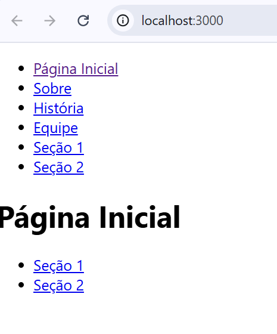
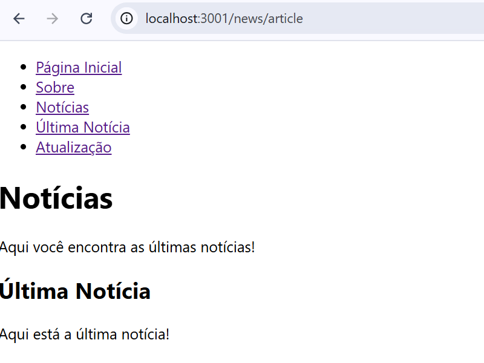

## Print da primeira questão:

## Print da segunda questão:

## O que foi feito:

# Projeto React - Navegação com Sub-Rotas

Este é um projeto simples de React onde implementamos navegação usando **React Router** com sub-rotas. O objetivo foi criar uma aplicação com duas páginas principais: **Home** e **About**, cada uma com suas próprias sub-rotas.

## O que foi pedido:

1. **Configuração Básica de Rotas:**
   - Criar uma aplicação React com duas rotas principais: uma para a página inicial ("/") e outra para a página de "Sobre" ("/about").
   - Cada página deve exibir um título correspondente: "Página Inicial" para a página inicial e "Sobre" para a página "Sobre".
   - O uso de **React Router** é necessário para configurar essas rotas.

2. **Sub-rotas nas Páginas "Home" e "About":**
   - Estender a aplicação para adicionar **sub-rotas** nas páginas "Home" e "About".
   - Na página **Home**, criar rotas para "Seção 1" (`/home/section1`) e "Seção 2" (`/home/section2`).
   - Na página **About**, criar rotas para "História" (`/about/history`) e "Equipe" (`/about/team`).
   - Cada sub-rota deve exibir um conteúdo diferente.

## O que foi entregue:

### 1. **Configuração Básica de Rotas**
   - Foi configurada a navegação básica usando **React Router** com duas páginas principais:
     - **Página Inicial** (`/home`)
     - **Sobre** (`/about`)
   - O conteúdo das páginas principais foi definido como "Página Inicial" e "Sobre", respectivamente.
   
### 2. **Sub-rotas nas Páginas "Home" e "About"**
   - Para a **página Home**:
     - Foram criadas as sub-rotas `section1` e `section2`.
     - Cada sub-rota exibe um conteúdo específico dentro da página "Home", com os títulos "Seção 1" e "Seção 2".
   
   - Para a **página About**:
     - Foram criadas as sub-rotas `history` e `team`.
     - Cada sub-rota exibe um conteúdo específico dentro da página "About", com os títulos "História" e "Equipe".
   
### 3. **Navegação**
   - Em ambas as páginas principais (Home e About), foi adicionada uma **navegação simples** com links para suas respectivas sub-rotas.
   - Ao clicar nos links, o conteúdo correspondente é carregado dentro das páginas principais, usando o componente **`Outlet`** do **React Router**.
   

   ## [16/01/2025] Parte segunda da atividade:

   ## Print da primeira questão:

   

   
   ## Print da segunda questão:

   

# Projeto React - Navegação com Sub-Rotas

Este é um projeto simples de React que implementa navegação usando o **React Router** com sub-rotas. O projeto inclui páginas principais como **Página Inicial** e **Sobre**, além de sub-rotas com conteúdo específico dentro dessas páginas. 

## O que foi pedido:

1. **Configuração Básica de Rotas**:
   - Criar uma aplicação React com duas rotas principais:
     - Página inicial ("/home").
     - Página de "Sobre" ("/about").
   - Cada página deve exibir um título correspondente ("Página Inicial" para a página inicial e "Sobre" para a página de "Sobre").
   - Utilização do **React Router** para configurar as rotas.

2. **Sub-rotas nas Páginas "Home" e "About"**:
   - Para a página **Home**:
     - Criar sub-rotas para "Seção 1" ("/home/section1") e "Seção 2" ("/home/section2").
   - Para a página **About**:
     - Criar sub-rotas para "História" ("/about/history") e "Equipe" ("/about/team").
   - Cada sub-rota deve exibir um conteúdo diferente.
   
3. **Navegação**:
   - Adicionar links de navegação nas páginas principais (Home e About), permitindo acessar suas sub-rotas.

4. **Criar mais páginas**:
   - Criar **três novas páginas**: **Contact**, **Services**, e **Blog**.
   - Configurar a navegação via links ou função pragmática.

5. **Criar um componente filho e subcomponentes aninhados**:
   - Criar um componente chamado `/news`.
   - Dentro dele, criar dois componentes filhos aninhados: **Article** e **Update**.

## O que foi entregue:

1. **Configuração Básica de Rotas**:
   - A aplicação foi configurada com duas rotas principais: 
     - **Página Inicial** ("/") com o título "Página Inicial".
     - **Sobre** ("/about") com o título "Sobre".
   - A navegação foi implementada utilizando o **React Router**, permitindo que os usuários naveguem entre essas páginas.

2. **Sub-rotas nas Páginas "Home" e "About"**:
   - Para a página **Home**, foram criadas as sub-rotas:
     - **/home/section1** exibe o conteúdo da "Seção 1".
     - **/home/section2** exibe o conteúdo da "Seção 2".
   - Para a página **About**, foram criadas as sub-rotas:
     - **/about/history** exibe o conteúdo sobre a "História".
     - **/about/team** exibe o conteúdo sobre a "Equipe".

3. **Navegação**:
   - Foi adicionado um menu de navegação com links para:
     - **Página Inicial**
     - **Sobre**
     - **Contato**
     - **Serviços**
     - **Blog**
     - **Seção 1** e **Seção 2** dentro da Home
     - **História** e **Equipe** dentro da About

4. **Criação de Páginas Adicionais**:
   - Foram criadas três novas páginas:
     - **Contact** ("/contact")
     - **Services** ("/services")
     - **Blog** ("/blog")
   - Cada página exibe um título e conteúdo simples, como foi pedido.

5. **Criação de Componente Filho e Subcomponentes Aninhados**:
   - Foi criado um componente **News** ("/news").
   - Dentro de **News**, foram criados dois componentes filhos aninhados:
     - **Article** ("/news/article")
     - **Update** ("/news/update")
   - As sub-rotas **Article** e **Update** são renderizadas dentro de **News** usando o componente `Outlet`.

