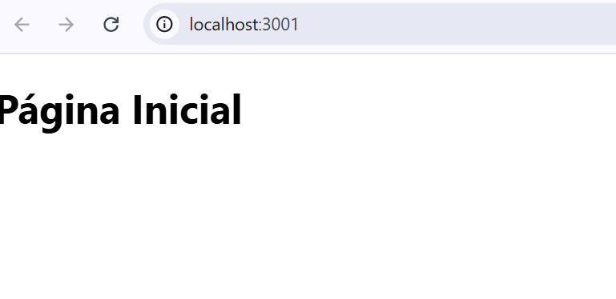
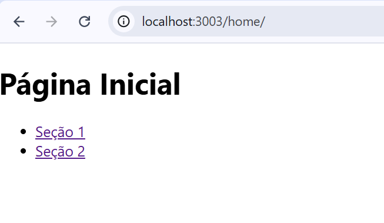

## Print da primeira questão:

## Print da segunda questão:

## O que foi feito:

# Projeto React - Navegação com Sub-Rotas

Este é um projeto simples de React onde implementamos navegação usando **React Router** com sub-rotas. O objetivo foi criar uma aplicação com duas páginas principais: **Home** e **About**, cada uma com suas próprias sub-rotas.

## O que foi pedido:

1. **Configuração Básica de Rotas:**
   - Criar uma aplicação React com duas rotas principais: uma para a página inicial ("/") e outra para a página de "Sobre" ("/about").
   - Cada página deve exibir um título correspondente: "Página Inicial" para a página inicial e "Sobre" para a página "Sobre".
   - O uso de **React Router** é necessário para configurar essas rotas.

2. **Sub-rotas nas Páginas "Home" e "About":**
   - Estender a aplicação para adicionar **sub-rotas** nas páginas "Home" e "About".
   - Na página **Home**, criar rotas para "Seção 1" (`/home/section1`) e "Seção 2" (`/home/section2`).
   - Na página **About**, criar rotas para "História" (`/about/history`) e "Equipe" (`/about/team`).
   - Cada sub-rota deve exibir um conteúdo diferente.

## O que foi entregue:

### 1. **Configuração Básica de Rotas**
   - Foi configurada a navegação básica usando **React Router** com duas páginas principais:
     - **Página Inicial** (`/home`)
     - **Sobre** (`/about`)
   - O conteúdo das páginas principais foi definido como "Página Inicial" e "Sobre", respectivamente.
   
### 2. **Sub-rotas nas Páginas "Home" e "About"**
   - Para a **página Home**:
     - Foram criadas as sub-rotas `section1` e `section2`.
     - Cada sub-rota exibe um conteúdo específico dentro da página "Home", com os títulos "Seção 1" e "Seção 2".
   
   - Para a **página About**:
     - Foram criadas as sub-rotas `history` e `team`.
     - Cada sub-rota exibe um conteúdo específico dentro da página "About", com os títulos "História" e "Equipe".
   
### 3. **Navegação**
   - Em ambas as páginas principais (Home e About), foi adicionada uma **navegação simples** com links para suas respectivas sub-rotas.
   - Ao clicar nos links, o conteúdo correspondente é carregado dentro das páginas principais, usando o componente **`Outlet`** do **React Router**.
   

